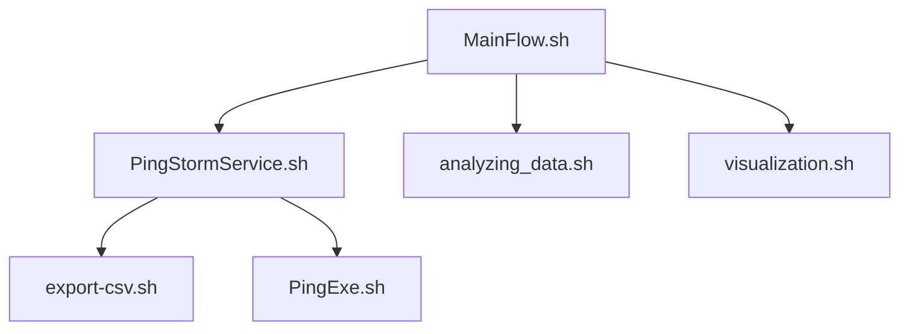

# PingStorm task

## Overview

### requirements
The projects is intended to run on a **LINUX** machine, we specifically ran it on a virtual machine as is required by the course, but any linux machine should suffice.

### how to run and download
To download please use the command `git clone git@github.com:shayTheshay/PingStorm.git` into your repository, it will download all the .sh files and the temporary files like .txt 
When runnin you should only run the manager file which is called "MainFlow.sh" and will run the other scripts according to user requests.

You can run the mananger file by typing 
./MainFlow.sh

Please notice you have some temporary files, currently some of them are not removable.
### general information
The project itself is a small group assignment conducted by one of [appleseeds](https://appleseeds.org.il/) programs, specificaly the `aws re/start` program.

This program is the introduction to networking.
Which will start on the weeks ahead.

### goal
The PingStorm is a pinging summarizing code!
It is supposed to send a ping(hello for computer) and wait for the response(If there is even one) and do some cool stuff with it.

The manager has 6 functions:
1. Start PingStorm service (sent the pings every 45s) 
2. Stop PingStorm service (stop running every 45s)
3. Review PingStorm service execution status
4. Show the latest log entries for PingStorm
5. Visualize the values for each service, slowest and fastest
0. Press 0 to exit the code (or ctrl + c)

***Picture will be updated a few days from now***

### Picture for MainFlow 

### Picture for Visualization

## Noticable scripts
1. **MainFlow.sh**   
    * Activates the other scripts (Separation of concern)
    * Check for the process id for easy use
    * Can show the last 10 logs

2. **PingExe.sh**
    * Pings other servers(computers)
    * Run in a loop 

3. **export_csv.sh**
    * Inserts the data for the user 
    * Adds to the file if it exists
4. **visualization**
    * Has emojis for fun to read feel
    * shows bar for longer or shorter ms
5. **loggin** 
    * Can show different type messages(error, warning, info)
    * logs the information info a directory

## Task code considerations

1. **Logging function shell source**   
    
    * Logging functionality will be implemented as a generic function, invoked from several independent scripts. Hence that logging function is maintained in a branch of its own, and saved in a script which will be **sourced (. command)**. Description was shared with rest of team members as per how to invoke it:

# Logging function call structure:                              #
#                                                               # 
# PingStormLog {1|2|3} {<OPERATION>} {<DESTINATION>} {RESPONSE} #
#                                                               # 
# Usage example:                                                # 
#                                                               # 
# PingStormLog 2 PING x.com timeout                             #
  
    
    * Log entries, created by invoking the logging function, are letting viewer know which script has issued the entry. For that the basename is used (precisely, calling basename with argument $0). This is working correctly even when the basename call is from any other script, which is running source (. command) to the script containing the logging function. In short, **the scope** of such source makes anything from the included code an **integral part of the calling script's shell**.

## Application Flow

## Collaborators

Collaborating personnel include:

- [Shay Solomon](https://www.linkedin.com/in/shay-solomon/)
- imad tori
- eyal golan gluck
- dikla buchnik
- Lior 
